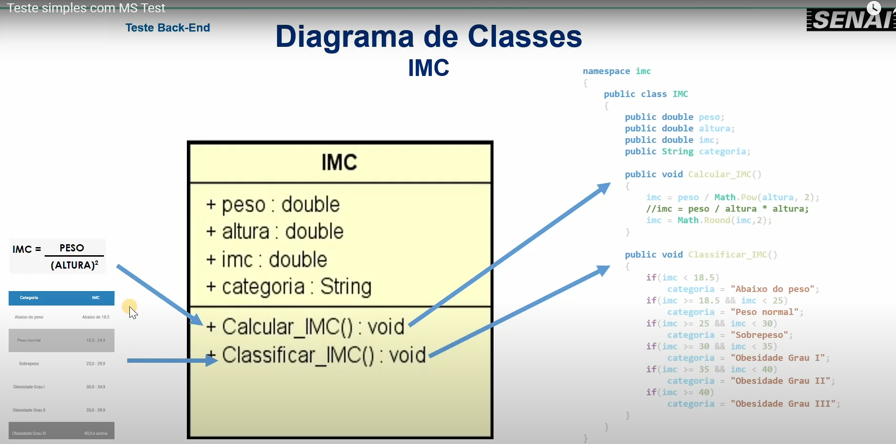

Show! Aqui está o `README.md` atualizado com a legenda explicando que a imagem representa o **diagrama de classes da aplicação de cálculo do IMC**:

---

```markdown
## 🧪 Projeto de Testes - IMC com MSTest (.NET)

<p align="center">
  
  <br/>
  <em>Figura: Diagrama de classes da aplicação de cálculo do IMC</em>
</p>

Este repositório apresenta um módulo de testes automatizados utilizando o framework **MSTest**, nativo do ecossistema **.NET**, aplicado à validação de uma classe responsável pelo cálculo e classificação do IMC (Índice de Massa Corporal).

Os testes seguem a abordagem **AAA (Arrange, Act, Assert)**, uma prática comum e recomendada para organizar testes de forma clara:

- **Arrange (Preparar):** configura os dados e objetos necessários;
- **Act (Agir):** executa o método que será testado;
- **Assert (Verificar):** valida se o resultado é o esperado.

---

### ✅ Estrutura dos Testes

Foram utilizados dois atributos principais da biblioteca MSTest:

#### `[TestMethod]`
Utilizado para validar um cenário específico.  
No exemplo a seguir, o teste verifica se o cálculo do IMC está correto para determinado peso e altura:

```csharp
[TestMethod]
public void Teste_Calculo_IMC()
{
    // Arrange
    double imc_previsto = 31.25;
    IMC i = new IMC();
    i.peso = 80;
    i.altura = 1.60;

    // Act
    i.Calcular_IMC();

    // Assert
    Assert.AreEqual(imc_previsto, i.imc);
}
```

#### `[DataTestMethod]` com `[DataRow(...)]`
Permite executar o mesmo teste com vários conjuntos de dados.  
Neste caso, é utilizado para verificar se a classificação do IMC corresponde à categoria esperada:

```csharp
[DataTestMethod]
[DataRow("Abaixo do peso")]
[DataRow("Peso normal")]
[DataRow("Sobrepeso")]
[DataRow("Obesidade Grau I")]
[DataRow("Obesidade Grau II")]
[DataRow("Obesidade Grau III")]
public void Teste_Categoria_IMC(string cat)
{
    // Arrange
    IMC i = new IMC();
    i.peso = 80;
    i.altura = 1.60;

    // Act
    i.Calcular_IMC();
    i.Classificar_IMC();

    // Assert
    Assert.AreEqual(i.categoria, cat);
}
```

> ⚠️ **Atenção:** todos os testes usam os mesmos valores de entrada. Para que todos os `DataRow` passem, seria necessário ajustar `peso` e `altura` conforme a categoria esperada. O objetivo acima é demonstrar o funcionamento da estrutura.

---

### 🖥️ Exemplo de Saída no Terminal

#### ✅ Teste com sucesso:

```bash
Passed Teste_Calculo_IMC
Passed Teste_Categoria_IMC("Obesidade Grau I")
```

#### ❌ Teste com falha:

```bash
Failed Teste_Categoria_IMC("Peso normal")
  Assert.AreEqual failed. Expected:<Peso normal>. Actual:<Obesidade Grau I>. 
  at atividade_imc_mstest.UnitTest1.Teste_Categoria_IMC(String cat) in C:\Testes\UnitTest1.cs:line 28
```

A mensagem acima mostra que o teste falhou porque o valor **esperado** era `"Peso normal"`, mas o valor **real** retornado foi `"Obesidade Grau I"`.

---

### 🛠 Tecnologias Utilizadas

- [.NET 6.0.428](https://dotnet.microsoft.com/)
- [C#](https://learn.microsoft.com/dotnet/csharp/)
- [MSTest](https://learn.microsoft.com/dotnet/core/testing/unit-testing-with-mstest)

---

### ▶️ Como Executar

Siga os passos abaixo para compilar e rodar os testes localmente:

1. Abra o terminal na raiz do projeto.

2. Restaure os pacotes (caso necessário):
   ```bash
   dotnet restore
   ```

3. Compile a aplicação:
   ```bash
   dotnet build
   ```

4. Execute os testes:
   ```bash
   dotnet test
   ```
